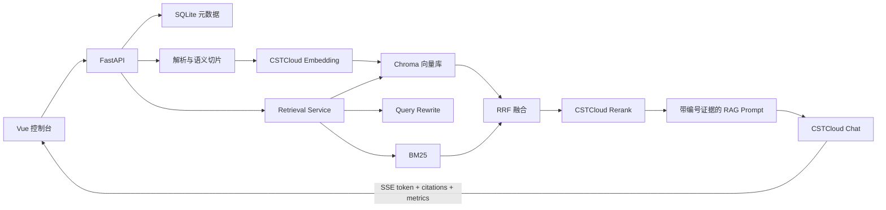

# CSTCloud-RAG 智能知识库问答系统

一个面向企业知识管理与 AI 开发岗位展示的完整 RAG Web 项目。系统通过后端统一调用中国科技云 OpenAI-Compatible API，支持聊天模型、Embedding 和 Rerank 模型动态切换，提供多知识库、混合检索、Query Rewrite、SSE 流式回答与逐条引用溯源。

> 安全说明：项目不会在前端、数据库或日志中保存 API Key；仓库也不包含任何真实 Token。没有 Key 时服务仍可启动、浏览 UI 和查看内置候选模型，调用模型相关能力时会返回明确提示。

公开部署或二次开发前请阅读 [SECURITY.md](./SECURITY.md)。真实凭证只能保存在不会提交的 `backend/.env`；运行数据库、上传文档、向量索引、日志、依赖目录和构建产物均已加入 `.gitignore`。

> 部署边界：当前版本定位为本机作品演示，没有用户鉴权和租户隔离，不应直接暴露到公网。启动脚本与 Docker Compose 默认仅监听 `127.0.0.1`；Chroma 只使用进程内 `PersistentClient`，不启动 Chroma HTTP 服务。

## 新手一键启动

Windows 用户打开项目目录后，优先双击纯英文入口：

```text
START.bat
```

`启动项目.bat` 与它作用相同。脚本会检查 Python、Node.js、后端虚拟环境、前端依赖和 `.env`；如果发现 Python 版本不兼容或虚拟环境损坏，会自动选择 Python 3.11/3.12 重建。首次缺少依赖时自动安装，然后分别启动前后端并打开浏览器。启动失败时双击 `检查环境.bat`，检查完成后按任意键可直接继续启动。

完整的新手说明、停止方法和故障排查见：[使用与启动指南.md](./使用与启动指南.md)。

## 项目亮点

- 基于中国科技云 OpenAI-Compatible API 构建，统一封装 `/models`、`/chat/completions`、`/embeddings` 和 `/rerank`。
- 聊天、Embedding、Rerank 三类模型均可手动切换，也支持输入 `/models` 返回的任意模型 ID。
- Hybrid Search 将 Chroma 余弦向量召回与 BM25 关键词召回通过 RRF 融合，再交给云端 Rerank。
- Query Rewrite 把多轮上下文中的追问改写成独立检索问题，避免拿整段历史直接检索。
- 每个结论都可回溯到文件名、页码、chunk_id、原文、融合分数和重排分数。
- SSE 流式输出区分思考过程与最终回答，并统计检索、生成和端到端耗时。
- SQLite 管理知识库、文档、切片、配置、会话和消息；Chroma collection 按知识库及 Embedding 模型隔离，避免维度混用。
- 深色霓虹控制台包含文档/索引管理、切片检查器、模型配置、流水线状态和实时指标。
- 创建知识库后自动进入资料导入，支持多文件上传，也支持直接粘贴文本建立知识。
- 已预留 DeepSeek-OCR 与 Agent 工具适配边界，便于继续扩展文档总结、报告生成和多文档对比。

## 技术架构

| 层级 | 技术 | 职责 |
|---|---|---|
| Web | Vue 3、TypeScript、Vite、Pinia、Element Plus、TailwindCSS | 控制台、知识库管理、流式问答、引用交互 |
| API | FastAPI、Pydantic、Uvicorn | REST API、SSE、参数校验、异常处理 |
| RAG | Chroma、rank-bm25 | 向量召回、关键词召回、RRF 融合 |
| 数据 | SQLite、SQLAlchemy | 元数据、原文切片、配置、会话历史 |
| 模型 | CSTCloud API、httpx | Chat、Embedding、Rerank、模型列表 |
| 文档 | pypdf、python-docx、pandas、openpyxl | PDF、Word、表格和纯文本解析 |



## RAG 执行流程

1. 结合最近六条会话消息，将当前问题改写成可独立检索的查询。
2. 使用知识库创建时绑定的 Embedding 模型生成查询向量。
3. 分别执行 Chroma top-k 与 BM25 top-k 召回。
4. 使用加权 Reciprocal Rank Fusion 去重并融合候选。
5. 可选调用 CSTCloud Rerank，默认保留 5 个证据片段。
6. 将证据按 `[1]`、`[2]` 编号注入严格的防幻觉 Prompt。
7. 通过 SSE 返回思考片段、回答 token、引用和性能指标，并保存会话。

## 工程结构

```text
cstcloud-rag/
├── backend/
│   ├── app/
│   │   ├── api/          # FastAPI 路由
│   │   ├── clients/      # CSTCloud 统一客户端
│   │   ├── core/         # 环境配置与安全检查
│   │   ├── models/       # SQLAlchemy 与 Pydantic 模型
│   │   ├── prompts/      # RAG、改写、普通问答模板
│   │   ├── services/     # 解析、索引、检索、聊天等领域服务
│   │   └── tools/        # Agent 工具预留
│   ├── tests/
│   ├── requirements.txt
│   └── .env.example
├── frontend/
│   ├── src/components/   # 控制台组件
│   ├── src/stores/       # Pinia 状态与流式交互
│   └── src/api/          # REST/SSE 客户端
├── example-data/
└── docker-compose.yml
```

## 本地启动

### 1. 后端

需要 Python 3.10+，推荐 3.11。

```powershell
cd backend
python -m venv .venv
.\.venv\Scripts\Activate.ps1
pip install -r requirements.txt
Copy-Item .env.example .env
```

编辑 `backend/.env`，只在本机填写：

```dotenv
CSTCLOUD_API_KEY=你的中国科技云Token
CSTCLOUD_BASE_URL=https://uni-api.cstcloud.cn/v1
```

启动：

```powershell
uvicorn app.main:app --reload --port 8000
```

健康检查为 `http://localhost:8000/api/health`，Swagger 文档为 `http://localhost:8000/docs`。如果没有配置 Key，健康检查仍返回 200，模型调用返回 503。

### 2. 前端

需要 Node.js 18+，推荐 Node.js 20。

```powershell
cd frontend
npm install
npm run dev
```

访问 `http://localhost:5173`。Vite 会把 `/api` 代理到 `http://localhost:8000`。

## Docker 启动

在项目根目录设置仅对当前终端有效的环境变量，然后启动：

```powershell
$env:CSTCLOUD_API_KEY="你的中国科技云Token"
docker compose up --build
```

访问 `http://localhost:8080`。SQLite、Chroma 和上传文件保存在 Docker volume `rag_data` 中。请勿把 Token 直接写入 `docker-compose.yml`。

## 使用方式

1. 在左侧创建知识库；知识库会绑定创建时选中的 Embedding 模型，创建后自动打开资料导入面板。
2. 可一次多选上传 `txt/md/pdf/docx/csv/xlsx`，也可点击“粘贴文本建立知识”直接导入网页、笔记或业务资料。示例文件位于 `example-data/`。
3. 等待状态变为 `ready`，可打开切片检查器查看解析质量。
4. 在顶部选择聊天、Embedding、Rerank 模型，设置 RAG、Rerank、Rewrite 和思考模式。
5. 在聊天框提问；回答下方的来源卡片可展开原始 chunk 和评分。
6. 更换 Embedding 模型后，右侧会提示模型不一致。点击“重建”会删除旧 collection，并重新向量化该知识库的全部文档。

## RAG 数据是什么

RAG 数据不是重新训练模型的数据，而是你希望模型回答时优先参考的专属资料，例如公司制度、产品手册、课程讲义、论文、项目文档、FAQ 和表格。目前系统不预置业务知识：页面显示 `0 个知识切片` 时，即使打开 RAG 开关，也没有专属证据可检索，回答仍来自通用模型能力。

导入自己的数据：

1. 在左侧点击“创建第一个知识库”，并选择用于该知识库的 Embedding 模型。
2. 点击“创建并导入资料”，系统会自动选中知识库并打开右侧资料面板。
3. 一次多选上传 `txt/md/pdf/docx/csv/xlsx` 文件，或直接使用“粘贴文本建立知识”。
4. 等待状态变为 `ready`，确认页面显示的知识切片数量大于 0。
5. 开始提问，并通过回答下方的引用卡片检查原文、页码和分数。

数据边界：原始文件、SQLite 元数据和 Chroma 向量索引保存在 `backend/data/`；为生成向量和回答问题，相关文档切片会通过后端发送给所选 CSTCloud Embedding/Chat 模型。API Key 只保留在后端，但不要上传不允许发送给外部云模型的敏感资料。

## 模型兼容处理

- 模型选项优先来自 `GET /models`；无 Key 或远程失败时展示手册中的候选项，且始终允许手动输入 ID。
- `deepseek-r1` 只支持 `user` role，客户端会把 system/history/user 合并为单个 user 消息。
- Qwen3 系列使用 `chat_template_kwargs.enable_thinking`；`deepseek-v4-flash` 使用 `chat_template_kwargs.thinking`。
- Embedding collection 名包含知识库 ID、规范化模型名和模型名哈希，不同维度永不写入同一集合。
- Rerank 异常时会降级使用 RRF 排名，Query Rewrite 异常时会回退到原始问题。

> 模型是否实际授权、准确 ID 及参数支持范围以当前账号调用 `/models` 的结果为准。

## 主要 API

| 方法 | 地址 | 功能 |
|---|---|---|
| GET | `/api/health` | 健康状态与 Key 配置状态 |
| GET | `/api/models` | 远程或候选模型列表 |
| GET/POST | `/api/config` | 读取/保存模型与检索配置 |
| POST/GET/DELETE | `/api/knowledge-bases` | 知识库管理 |
| POST | `/api/knowledge-bases/{id}/reindex` | 更换 Embedding 后重建全库 |
| POST | `/api/knowledge-bases/{id}/documents/upload` | 上传、解析并索引 |
| GET/DELETE | `/api/documents/{id}/chunks`、`/api/documents/{id}` | 切片查看与文档删除 |
| POST | `/api/retrieval/search` | 独立检索调试 |
| POST | `/api/chat` | 非流式问答 |
| POST | `/api/chat/stream` | SSE 流式问答 |
| GET/POST/DELETE | `/api/conversations` | 会话管理 |
| POST | `/api/eval/single` | 单条回答基础评测 |

## 安全与数据边界

- `CSTCLOUD_API_KEY` 仅由后端环境变量读取，Pydantic 设置对象会隐藏其 repr。
- `.env`、数据库、上传文件、Chroma 数据、日志和构建产物均被 `.gitignore` 排除。
- 日志只记录 doc_id、kb_id、chunk 数量和错误类型，不记录文档正文或 Token。
- 上传文件名通过 `Path.name` 去除目录，限制扩展名和体积；所有外部调用有超时、有限指数退避与错误归一化。
- 回答 Prompt 强制仅依据证据，不足时输出“知识库中没有找到足够依据，无法确认。”

## 测试与构建检查

```powershell
cd backend
pytest -q
python -m compileall app

cd ..\frontend
npm run build
```

测试不需要真实 API Key。生产前建议补充针对授权账号的集成测试、文件病毒扫描、鉴权、速率限制和 PostgreSQL 迁移。

## 开源许可

本项目采用 [MIT License](./LICENSE)。GitHub Actions 会在推送和 Pull Request 时自动运行后端测试与前端构建，Dependabot 每周检查 Python、npm 和 Actions 依赖更新。

## 面试讲解话术

“这个项目不是把向量库接到大模型就结束。我把 RAG 拆成文档理解、索引、召回、融合、重排、生成和可观测七层。文档先按标题和段落语义切分；查询侧将 Chroma 语义召回与 BM25 精确词召回用 RRF 融合，再调用科技云 Rerank。多轮追问先改写成独立查询，避免历史噪声进入检索。每个证据保留文件、页码、chunk 和两阶段分数，SSE 首先返回引用，再逐 token 返回答案，所以 UI 能同时做到低首字延迟和完整溯源。Embedding 模型切换时，我用模型隔离 collection 并要求全库重建，解决了不同维度向量误写这一常见工程问题。”

可继续追问的设计取舍：

- 为什么采用 RRF，而不是直接相加 BM25 与余弦分数：两类分数尺度不同，RRF 对尺度更稳健。
- 为什么切片原文还保存在 SQLite：便于 BM25、切片检查、审计和向量库重建。
- 为什么不是全程异步任务：当前展示版优先保证事务路径易理解；生产版会将解析与 Embedding 放入 Celery/RQ。
- 如何评估：离线构造问题-证据集，分别看 Recall@K、MRR、引用准确率、忠实度与 P95 延迟。

## 后续优化方向

1. 接入 OAuth2/RBAC、多租户数据隔离、审计日志和限流。
2. 将 SQLite 升级为 PostgreSQL，引入 Alembic；索引任务迁入 Celery/RQ 并提供进度事件。
3. 对扫描 PDF 接入手册预留的 DeepSeek-OCR `/deepseek-ocr/convert` 与状态轮询。
4. 引入标题路径、表格结构、父子 chunk、动态 top-k 和上下文压缩。
5. 建立 RAGAS/LLM-as-Judge 评测集与可观测追踪，比较不同 Embedding/Rerank 组合。
6. 注册 `search_knowledge_base`、`summarize_document`、`compare_documents` 和 `generate_report` 为 Agent 工具。
7. 生产部署加入对象存储、Kubernetes、备份恢复、监控告警和蓝绿发布。

## 致谢

感谢中国科技云（China Science and Technology Cloud, CSTCloud）提供的大语言模型接口服务支持。
